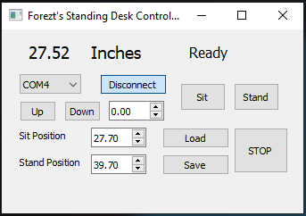
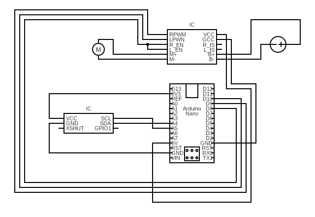

# easy-standing-desk

This is a simple add-on modification to my generic standing desk to add save, load, automatic height adjust and manual height adjust function. All of that with a gui controller from a computer, communicating via serial to arduino.

### Disassemble Desk's Switch

There are 4 wires connect to the desk controller board with a JST connector. There are 2 active-high [Omron SS5](https://omronfs.omron.com/en_US/ecb/products/pdf/en-ss.pdf) switches on the board to control up and down or left and right(motor spin). When we push the switch, the switch just change the polarize of the wire. So that the motor spin.

#### *Credit pictures are from user [Frank Lee](https://electronics.stackexchange.com/users/260954/frank-lee) from (https://electronics.stackexchange.com)*

### Modules used

PWM Module BTS7960 - To make life easy for controll the motor

 Time-of-Flight ranging sensor VL53L0X - A fast and accurate range sensor to measure height
 
 ### Circuit Diagram
 
 In our case, we connect the green from the desk to M+, white to M-, red to B+ and black to B-.
 
 

### Library Used

[BTS7960](https://github.com/luisllamasbinaburo/Arduino-BTS7960)

[Adafruit VL53L0X](https://github.com/adafruit/Adafruit_VL53L0X)
